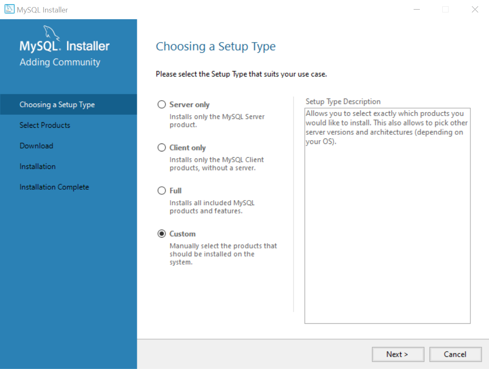
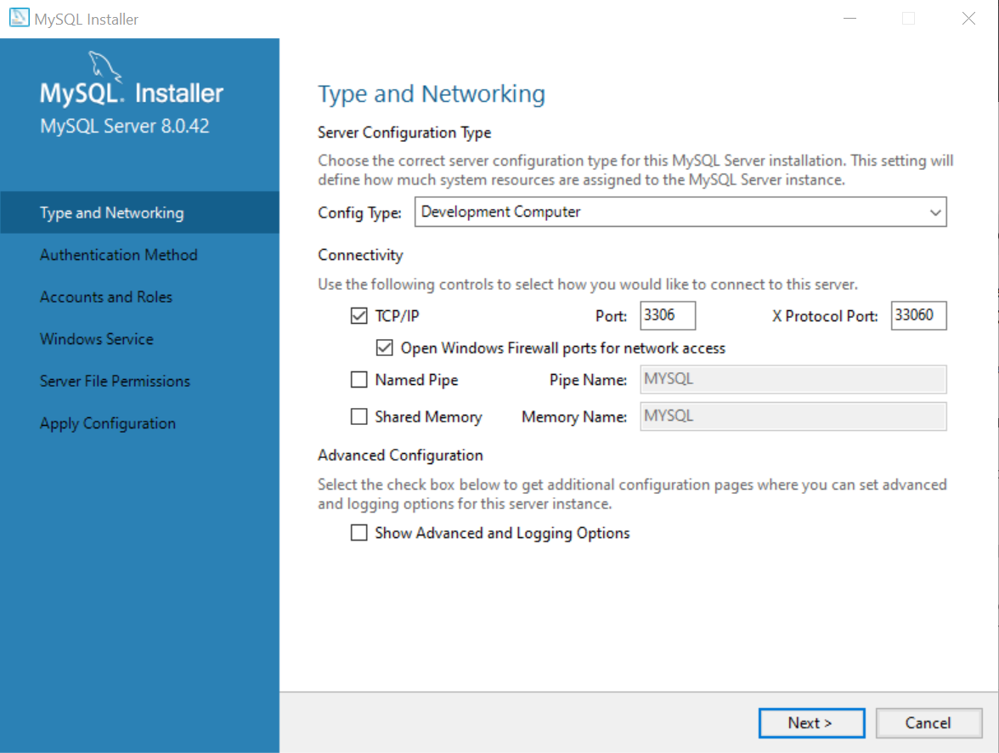
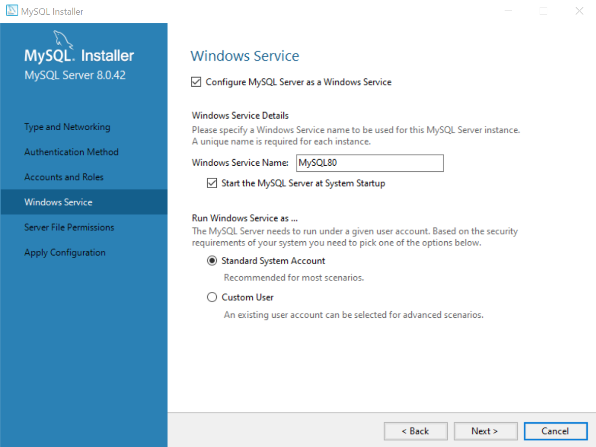
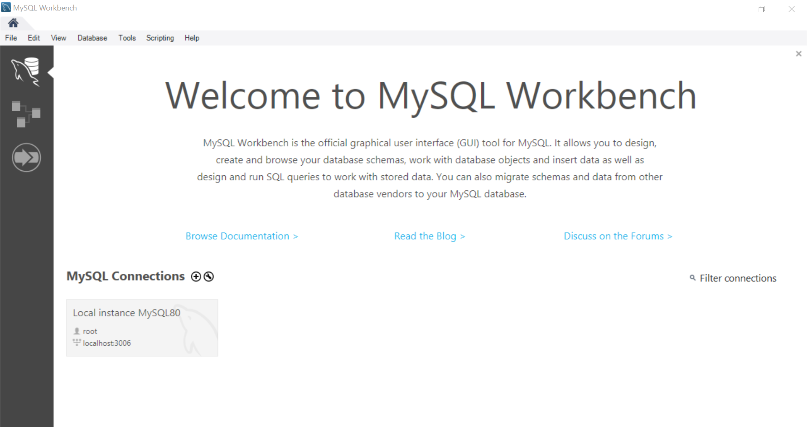
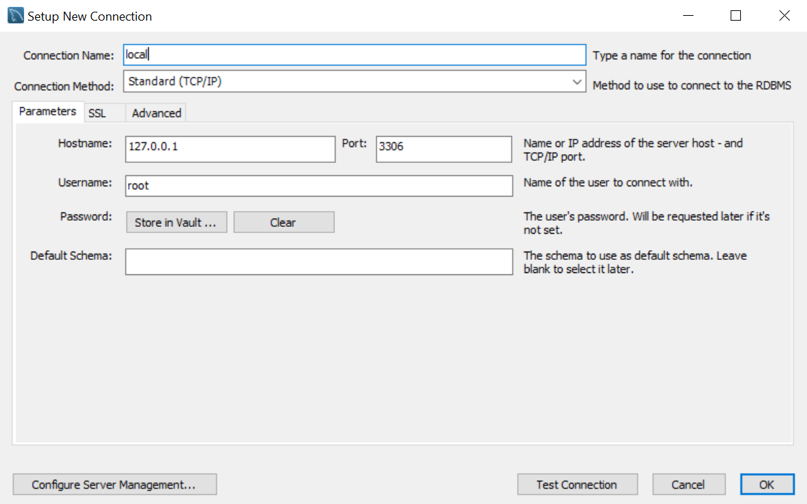
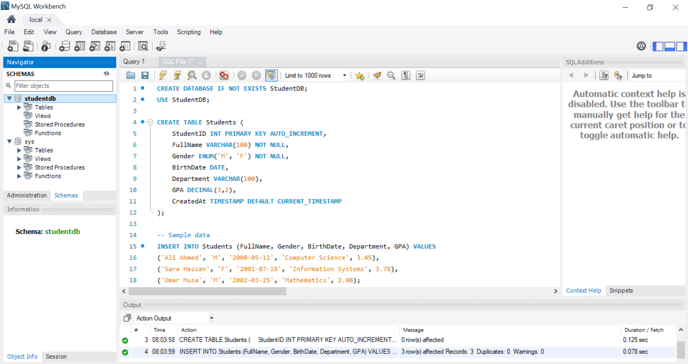
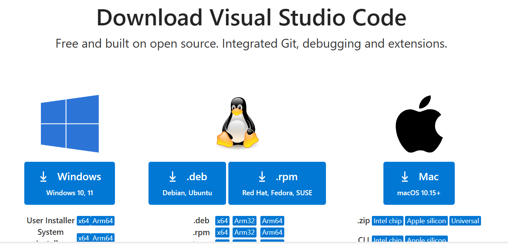

# Setup environment 

**Objective:**

* To set up **MySQL Database Management System**
* To connect to **MySQL** server
* To set up **Python Programming Langauge**

**Software:**

* MySQL installer (offline version)
* Visual Studio code (VS code)

## **Prerequisites:** Install Microsoft Visual C++ 2019 Redistributable

<span style="color: red;"> If you already have Microsoft Visual C++ 2019 Redistributable installed, you can skip this step and continue with the lab.</span>


1. Go to the official Microsoft page.
[Download VC++ Redistributables](https://learn.microsoft.com/en-us/cpp/windows/latest-supported-vc-redist?view=msvc-170#visual-studio-2015-2017-2019-and-2022)
2. Download the file based on your system:
    * for 64-bit [VC_redist.x64.exe](https://aka.ms/vs/17/release/vc_redist.x64.exe)
    * for 32-bit [VC_redist.x86.exe](https://aka.ms/vs/17/release/vc_redist.x86.exe)
3. Open the downloaded file and check on **I agree to the license terms and conditions**.
    <figure markdown="span">
    { width=400 }
    </figure>
4.  After installation, **restart your PC**.
    <figure markdown="span">
    { width=400 }
    </figure>


## MySQL

MySQL is an open-source relational database management system (RDBMS) that uses SQL to create, manage, and query data.

### Why we will use MySQL?

1. Support **ACID transaction properites**, essential for understanding transaction management
2. Uses the **InnoDB** transactional storage engine, which supports **concurrency control** and **recovery mechanisms**
3. Flexible and easy-to-use

### Installing MySQL (Offline)

1. Go to the official [MySQL Downloads Page](https://dev.mysql.com/downloads/installer/)
2. Download the **Windows (x86, 32-bit), MSI Installer** (Offline version ~353.7M)
    <figure markdown="span">
    {width="400"}
    </figure>
3. After open the Installer Choose **Custom**
    <figure markdown="span">
    {width="400"}
    </figure>
4. Select **MySQL Servers** and **MySQL Workbench**
    <figure markdown="span">
    {width="400"}
    </figure>
5. Proceed through the installation wizard
6. Use the default port (3306)
    <figure markdown="span">
    {width="400"}
    </figure>
7. Choose the Authentication Method as below
    <figure markdown="span">
    {width="400"}
    </figure>
8. Create a root password
9. Choose Windows Service as below
    <figure markdown="span">
    {width="400"}
    </figure>
10. Proceed through the installation wizard untill finish

### What after install MySQL?

1. After installing MySQL, connect to the **MySQL Server**. by clicking the `+` symbol next to MySQL Connections
    <figure markdown="span">
    {width="400"}
    </figure>
2. In the dialog box, enter a **Connection name**, e.g.,`Local`
    <figure markdown="span">
    {width="400"}
    </figure>
3. Click **Test Connection** and enter your MySQL root password to verify the connection
    <figure markdown="span">
    {width="400"}
    </figure>
4. After successfully connecting to the MySQL server, create a new database called `StudentDB`:
    * Open `local` connection
    * Click **Create new SQL** from the top-left corner
    * Write SQL commands to create the `StudentDB` database, a `Students` table, and insert sample data.
    * Execute the Script using Execute button ⚡
    <figure markdown="span">
    {width="400"}
    </figure>
    ``` SQL
    /*
    Name: Amira Naser Aldeein
    Index: 01x-xxx
    Department: e.g., CS
    */

    CREATE DATABASE IF NOT EXISTS StudentDB;
    USE StudentDB;

    CREATE TABLE Students (
        StudentID INT PRIMARY KEY AUTO_INCREMENT,
        FullName VARCHAR(100) NOT NULL,
        Gender ENUM('M', 'F') NOT NULL,
        BirthDate DATE,
        Department VARCHAR(100),
        GPA DECIMAL(3,2),
        CreatedAt TIMESTAMP DEFAULT CURRENT_TIMESTAMP
    );

    -- Sample data
    INSERT INTO Students (FullName, Gender, BirthDate, Department, GPA) VALUES
    ('Ali Ahmed', 'M', '2000-05-12', 'Computer Science', 3.45),
    ('Sara Hassan', 'F', '2001-07-18', 'Information Systems', 3.78),
    ('Omar Musa', 'M', '2002-03-25', 'Mathematics', 2.90);
    ```
    !!! info "Once you create the database, you will see it listed under the Schemas section on the left panel"
5. Now you can run SQL queries on your new database
    <figure markdown="span">
    {width="400"}
    </figure>
    ``` SQL
    USE StudentDB;
    SELECT * FROM Students;
    ```

#### What do we mean by Connection and Port?
A database connection is a communication link between a client application (e.g., MySQL Workbench) and the MySQL server. When an application (the client) needs to perform operations such as creating databases, running queries, or retrieving data, it establishes a connection to communicate with the server.
The port is a communication endpoint on your machine. By default, MySQL uses port `3306` to listen for incoming client requests.
In short, a connection is essential to allow your client tools or applications to interact with the MySQL server, run queries, manage data, and exchange information.

## Python programming language

We will use the **Python programming language** to simulate the following:
    * Concurrency control algorithms
    * Database recovery techniques

### Download and Install Python

1. Go to the **[Python](https://www.python.org/downloads/)** official website
2. Download the latest stable version
3. Open the installer and check 
    * Add Python to PATH

### Download and Install VS Code 

1. Visit the website **[VS code](https://code.visualstudio.com/Download)** Click on `Windows` to download VS code for Windows, as shown below<br>
    <figure markdown="span">
    { width="400" }
    </figure>
2. After the download finished open the `VSCodeUserSetup` executable file, when it open select `I accept the agreement` then click on `Next`<br>
    <figure markdown="span">
    { width="400" }
    </figure>
3.	Select all the option as seen below<br>
    <figure markdown="span">
    { width="400" }
    </figure>
4.	Finally we are ready to install the VS code, click on `install` and wait untail the setup finish
5.	On the Vs code, on the left-hand side, click on `extension` then in the search bar, write `Python` select `Python microsoft` and click on `Install` as shown below<br>
    <figure markdown="span">
    { width="400" }
    </figure>

## Alteranative way to practice:
    * Online Postgred server **[supabase](https://supabase.com/)**
    * Online Python Editer **[programiz](https://www.programiz.com/python-programming/online-compiler/)**

## Assignment: Install MySQL, Create a Database, and Query It
!!! attention "Due Date on 24/5/2025"

<span style="color: red;"> See the requirement about the structures of the lab **[here](general_instructions.md)**</span>

1. Download and Install MySQL
2. Connect to the server
3. Create a New Database
4. Create a Table
5. Insert Data
6. Query the Data
    ```SQL
    USE DatabaseName;
    SELECT * FROM TableName;
    ```
### What to assign:

Take Screenshots:

1. SQL code (on MySQL)
2. The output of your query
3. Put it all on one document