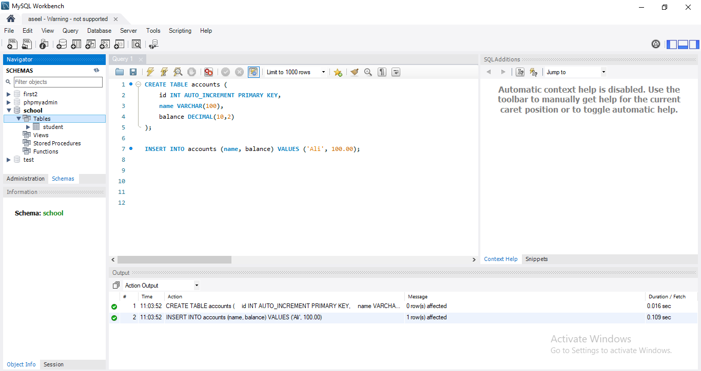
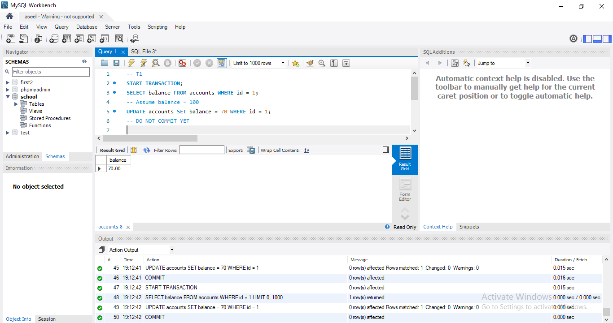
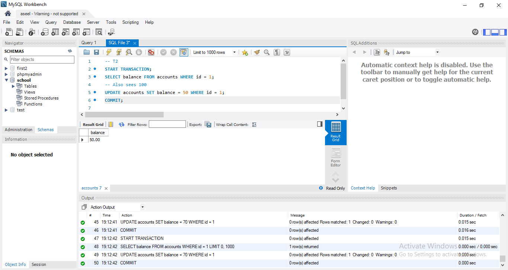
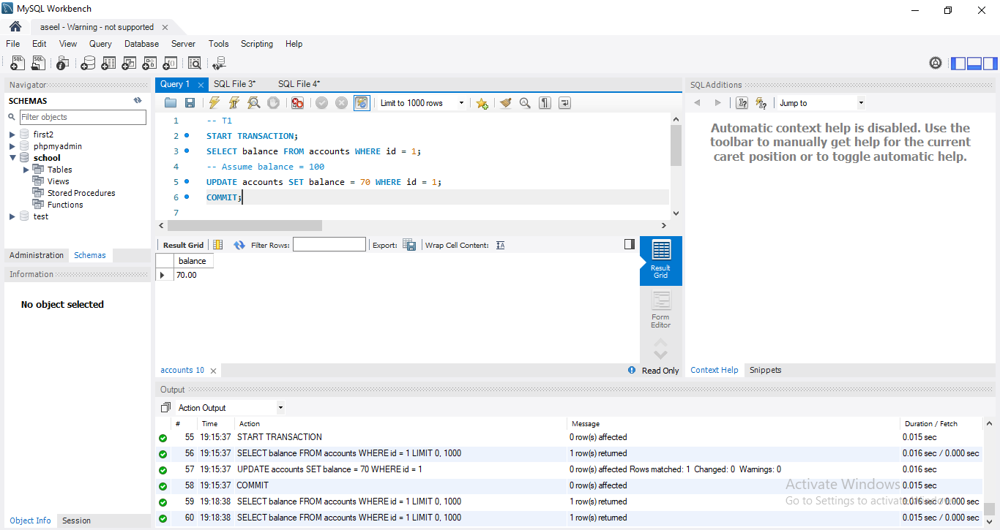
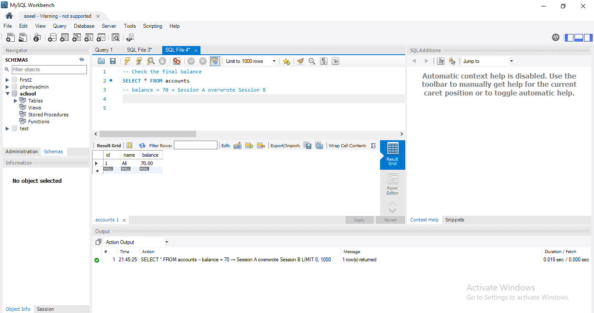

# Transaction Management and SQL Implementation

**Objective:**

* Understand the ACID properties.
* Implement SQL transactions.
* Understand transaction control.

## Understanding SQL Transactions

**A Transaction** is a sequence of ^^read^^ and ^^write^^ operations performed as a single logical unit of work.

**SQL Server operates in the following transaction modes:**

1. Autocommit transactions: Each individual statement is a transaction.
2. Explicit transactions: Each transaction is explicitly started with the `BEGIN TRANSACTION` statement and explicitly ended with a `COMMIT` or `ROLLBACK` statement **(which is concerned in this course)**.
3. Implicit transactions: A new transaction is implicitly started when the prior transaction completes, but each transaction is explicitly completed with a `COMMIT` or `ROLLBACK` statement.

---

###  Transaction Control Commands – `SAVEPOINT`, `ROLLBACK`, and `COMMIT`

### 🎯 Objective

Understand how to manage multi-step database transactions using SQL transaction control commands.

---

### ▶️ BEGIN

Start a new transaction:

```sql
BEGIN;
-- or
START TRANSACTION;
```

---

### 🔖 SAVEPOINT

Set a point you can roll back to later:

```sql
BEGIN;

INSERT INTO employees (id, name, department) VALUES (1, 'Alice', 'HR');
SAVEPOINT sp1;

INSERT INTO employees (id, name, department) VALUES (2, 'Bob', 'Finance');
SAVEPOINT sp2;

INSERT INTO employees (id, name, department) VALUES (3, 'Charlie', 'IT');
```

> ✅ At this point, we have added 3 employees and created two savepoints: `sp1` and `sp2`.

---

### 🔁 ROLLBACK

Undo part or all of a transaction.

#### 🔹 Rollback to a Savepoint

```sql
ROLLBACK TO sp2;
```

> This undoes only the insertion of **Charlie**, keeping **Alice** and **Bob**.

#### 🔸 Rollback Entire Transaction

```sql
ROLLBACK;
```

> This undoes **all** changes made in the transaction.

---

### 💾 COMMIT

Make all changes permanent:

```sql
COMMIT;
```

> After committing, the changes cannot be undone.

---

### 📌 Summary

* Use `SAVEPOINT` to mark logical checkpoints.
* Use `ROLLBACK` to undo mistakes.
* Use `COMMIT` to make sure the database saves your work.

This gives you control and safety when working with important or complex data operations.

---

### Transaction properties and how SQL supports them

**Transaction properties (ACID):**

1. **A - Atomicity:** All actions in transaction happen, or none happen. “*All or nothing…*”
2. **C - Consistency:** If each transaction is consistent and the database starts in a consistent state, it ends in a consistent state. “*It looks correct to me…*”
3. **I - Isolation:** Execution of one transaction is isolated from other transactions. “*All by myself…*”
4. **D - Durability:** Once a transaction commits, its effects are permanent. “*I will survive…*”

**How SQL Supports Each Property?**

| properties  | SQL Feature                          |
| ----------- | ------------------------------------ |
| Atomicity   | Use `START TRANSACTION`, followed by `COMMIT` or `ROLLBACK`  |
| Consistency | Enforced through constraints (e.g., `PRIMARY KEY`, `FOREIGN KEY`, `CHECK`)  |
| Isolation   | Set using `SET TRANSACTION ISOLATION LEVEL`    |
| Durability  |  Ensured by `COMMIT` and Logging mechanisms (e.g., write-ahead logs, redo logs) |


### Why Concurrency Control is Needed

Several problems can occur when concurrent transactions execute ^^without proper control^^, especially due to conflicting operations such as **Read-Write**, **Write-Read**, and **Write-Write** conflicts.

**Here is an illustrated problem with SQL transactions to simulate the problem:**

#### 1. Lost update problem

This problem occurs when two or more transactions read and update the same data item concurrently without being aware of each other's changes. As a result, the last update overwrites the previous ones, leading to the loss of some updates and causing data inconsistency.

###  Real-World Scenario

Two users (sessions) try to withdraw money from the same account at the same time:

- **User A** reads the balance = 100, decides to withdraw 30 → wants to update it to 70.
- **User B** also reads the balance = 100, decides to withdraw 50 → wants to update it to 50.
- If both updates happen without proper control, one will overwrite the other, leads to lost updates and incorrect final balance.


### Example of the Scenario in SQL:

To simulate a Lost Update in MySQL using two concurrent sessions:

#### 1) Create a Table:
Create any Database and create a table named `accounts` and insert sample data into it:

```sql

CREATE TABLE accounts (
    id SERIAL PRIMARY KEY,
    name TEXT,
    balance NUMERIC(10,2)
);


INSERT INTO accounts (name, balance) VALUES ('Ali', 100.00);

```

{ width="400" }

#### 2) Session A (user A):

```SQL

START TRANSACTION;
SELECT balance FROM accounts WHERE id = 1;
UPDATE accounts SET balance = 70 WHERE id = 1;

```

{ width="400" }

Here, user A reads the balance (100) and calculates the new balance: 100 - 30 = 70, then updates the record without commit. 

#### 3) Session B (user B, in another window):

```SQL

START TRANSACTION;
SELECT balance FROM accounts WHERE id = 1;
UPDATE accounts SET balance = 50 WHERE id = 1;
COMMIT;

```

{ width="400" }

Here, user B reads the balance (100) and calculates the new balance: 100 - 50 = 50, then  updates the record and commit. 

⚠️ ( Note:  to open two sessions in MySQL Workbench; Go to File → New Query Tab to open Session A, Repeat to open another tab (Session B). Each tab is a separate session — you can run SQL commands independently in each).

#### 4) Back to session A:

Now return back to session A again and commit the session:
 
 { width="400" }

#### 5) Check the final balance:

```SQL

SELECT * FROM accounts;

``` 
 { width="400" }

 Here we will see the balance becomes 70, and user B’s update (which should make the balance 50) is lost.


#### Conclusion:
-	Both transactions read the same initial value (100).
-	Each transaction updates the data without being aware of the other's changes.
-	The last transaction to commit determines the final value, possibly erasing the other's update.
-	Even though no errors appear, data integrity is lost. This demonstrates the importance of proper concurrency control in database systems.


#### 2. The Temporary Update (or Dirty Read) Problem

This occurs when one transaction ^^reads^^ data that has been ^^written^^ by another transaction that hasn’t committed yet. If the first transaction is later **rolled back**, the second transaction ends up working with invalid or temporary data — a dirty read.

**Example Scenario (Simulated):**

In an online electronics store:

1.  Ahmed initiates a purchase of 200 laptops. A transaction begins and temporarily reduces the stock quantity to 0, but the transaction is not yet committed.

2.  Meanwhile, Mohamed checks the available stock and sees 0 laptops — based on User A’s uncommitted change.

3. Then, Ahmed cancels the purchase, and the transaction is rolled back. The stock returns to its original quantity (e.g., 200).

4. However, Mohamed made a decision based on incorrect (temporary) data — the system gave them a dirty read.

**SQL Transaction for the scienario:**

1. Create the `Products` table to simulate the scenario
    ```SQL
    -- Create ProductDB Database
    CREATE DATABASE IF NOT EXISTS ProductDB;
    USE ProductDB;

    -- Create Products table
    CREATE TABLE Products (
        Id INT PRIMARY KEY,
        ProductName VARCHAR(100),
        Quantity INT
    );

    -- Insert Sample data
    INSERT INTO Products (Id, ProductName, Quantity) VALUES
    (1, 'Mobile', 100),
    (2, 'Tablet', 50),
    (3, 'Laptop', 200);
    ```
2.  In Session 1: Connect using the previous connection from [**Lab0**](Lab0.md) (named local), and open a new SQL query tab
    ```SQL
    USE ProductDB;

    -- Transaction 1: Simulate purchase
    START TRANSACTION;
        -- Pay 200 units from product with ID = 3 (assumed to be a laptop)
        UPDATE Products 
        SET Quantity = Quantity - 200
        WHERE Id = 3;
        -- Simulate waiting for payment confirmation
        DO SLEEP(15);
            -- Payment failed — rollback the transaction
    ROLLBACK;
    ```
    **We use SLEEP to simulate concurrent transactions. Note that `DO SLEEP(15)` works only in MySQL 8.0.29 or later**
3. Go to the Home tab and open the `local` connection again. (This step simulates a second session connected to the database.) Then, open a new SQL query tab to continue.
    ```SQL
    USE ProductDB;

    -- Transaction 2: Retrieve Laptop record
    SET TRANSACTION ISOLATION LEVEL READ UNCOMMITTED;
    START TRANSACTION;
        SELECT *
        FROM Products 
        WHERE Id=3;
    COMMIT;
    ```
4. In Session 1: Run the transaction and wait
    <figure markdown="span">
    { width="400" }
    </figure>
5. While Session 1 is still sleeping: Run Session 2
    <figure markdown="span">
    { width="400" }
    </figure>
6. After Session 1 completes and rolls back
    <figure markdown="span">
    { width="400" }
    </figure>
7. Conclusion: Session 2 was able to see the updated quantity (0 laptops) before Session 1 rolled back. This leads to inconsistent or misleading data, which is why isolation levels like `READ COMMITTED or REPEATABLE READ are important in real-world applications.

#### 3. The Incorrect Summary Problem

### 🧠 Problem Statement

When you use aggregate functions like `SUM`, `AVG`, and `COUNT` on a table while other transactions are modifying the data, the result may be **inconsistent**. This is because some rows might be updated **before** the function reads them, and others **after**.

---

### 🛠️ Step 1: Create the Table

```sql
CREATE TABLE accounts (
    id INT PRIMARY KEY,
    balance DECIMAL(10,2)
);
```

---

### 📥 Step 2: Insert Initial Data

```sql
INSERT INTO accounts (id, balance) VALUES
(1, 500.00),
(2, 750.00),
(3, 1200.00);
```

---

### 🔄 Step 3: Simulate Concurrent Transactions

####  Transaction T1 (Session 1)

```sql
BEGIN;
UPDATE accounts SET balance = balance + 100 WHERE id = 1;
-- not committed
```
#### Transaction T2 (Session 2)

```sql
SELECT SUM(balance) FROM accounts;
```
At this point, SUM() still uses the old value for id = 1 because the update in Session 1 (T1) hasn’t been committed.

SUM(balance) = 2450.00

---

### 💾 Step 4: Add COMMIT to T1 and Re-run

#### Transaction T1 (Session 1)


```sql
BEGIN;
UPDATE accounts SET balance = balance + 100 WHERE id = 1;
COMMIT;
```

 #### Transaction T2 (Session 2)

```sql
SELECT SUM(balance) FROM accounts;
```
Now, SUM() uses the new value for id = 1 because the update in T1 has been committed.

SUM(balance) = 2550.00

📌 Summary

If T1 is not committed, T2 sees old values.

If T1 is committed, T2 sees updated values.

Proper transaction management ensures consistent query results.

---

## Assignment: Simulate The Unrepeatable Read Problem
!!! attention "Due Date on 14/6/2025"

*   Read page 752 on the primary book (FUNDAMENTALS OF Database Systems)
*   <span style="color: red;">See the requirement about the structures of the lab [here](general_instructions.md)</span>
*   You can use any SQL editor (Online or Local), but be cautious — **transaction statements may vary slightly between different DBMSs**, and the use of `DO SLEEP` depends on the specific database engine. For example, `DO SLEEP()` is supported in MySQL 8.0.29+, while in other systems or older versions, you may need to use `SELECT SLEEP()` or an alternative approach.

### What to assign: 

1. A paragraph describing the scenario you will use to simulate the Unrepeatable Read problem.

2. A screenshot of the table you created for the simulation.

3. A screenshot showing the result of the first transaction after execution.

4. A screenshot showing the result of the second transaction after execution.

5. A paragraph discussing what happened, and how it demonstrates the Unrepeatable Read issue.
